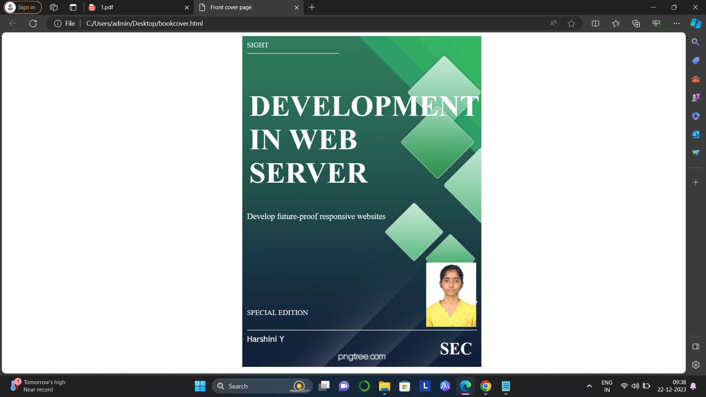

# cover-page-design
## AIM:
To develop a website to display the cover page design of a book

## Design Steps:

### Step 1:
clone into the repository named cover-page-design and create a django admin interface
### Step 2:
Write HTML and css for designing book cover page and execute them
## Code:
```<!DOCTYPE html>
<html>
    <head>
        <title>
            Front cover page
        </title>
        <style>
            .bookpage{
                height:700px;
                width:500px;
                margin-left:35%;
                background-image: url(book back cover.jpg);
                padding:10px;
                background-size: cover;
            }
            .hr1{
                width:200px

            }
            .booktitle{
                margin-top: 30px;
                color:white;
                padding:5px;
                font-size: xx-large;
            }
            .subtitle{
                color:white;
                font-size: large;
            }
            .mypic{
                position: relative;
                top:90px;
                left:390px;
                height: 80px;
                width: 90px;
            }
            .hr2{
                padding-top: 130px;
            
            }
            *{
                color: white;
            }
            .ed{
                position:relative;
                top: 110px;
            }
            .author{
                font-family: 'Trebuchet MS';
                font-size: large;
            }
            .pb{
                position: relative;
                left:420px;
                top:-40px;
                font-size: x-large;
            }
        </style>
        <body>
            <div class="bookpage">
            <div style="color:white">INSIGHT </div>
            <div class="hr1"><hr ></div>
            <div class="booktitle"><h1>WEB SERVER </h1></div>
            <div class="subtitle">Develop future-proof responsive websites</div>
            <div class="mypic"></div>
            <div class="ed">SPECIAL EDITION</div>
            <div class="hr2"><hr ></div>
            <div class="author"> Harshini</div>
            <div class="pb"> <h2>SEC</h2></div>
        </div>
        </body>
    </head>
</html>
```

## Output:


## Result:
Thus the program executed successfully
